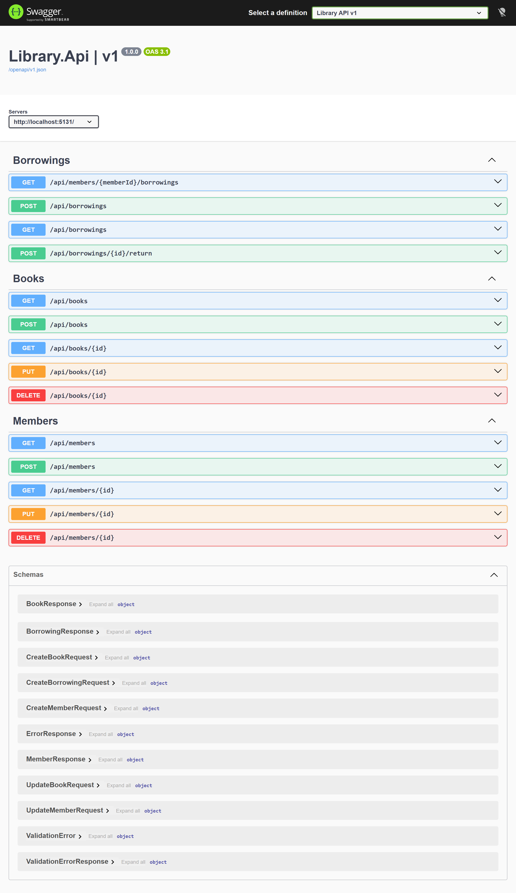
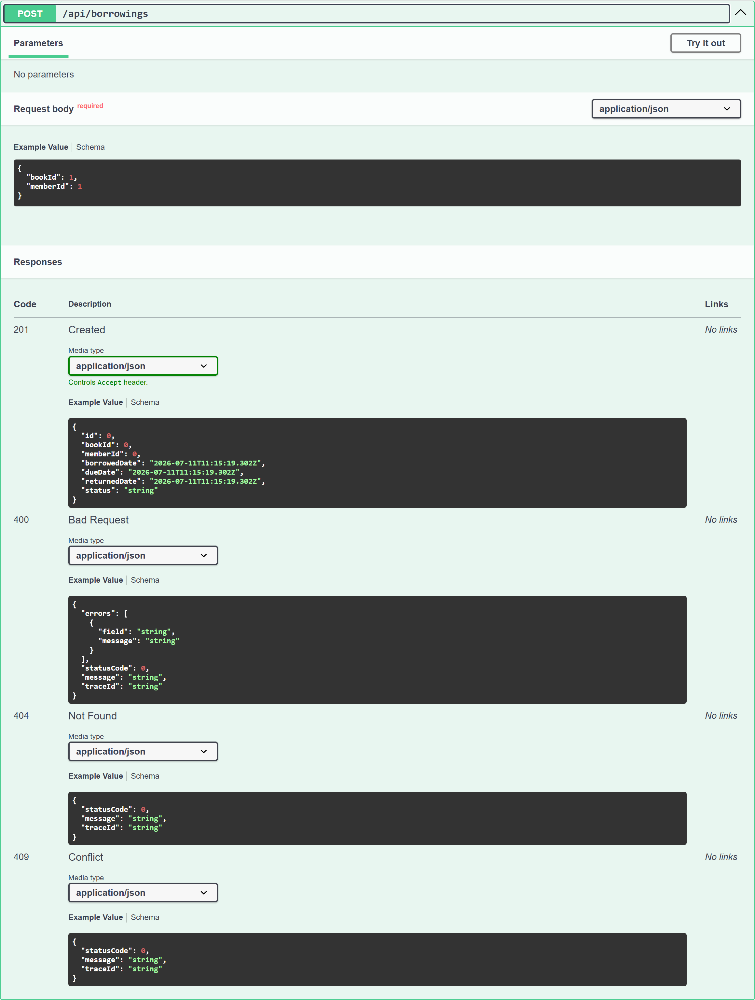

# Library Management System

## Overview

This project is a .NET 10 Minimal Web API for managing books, members, borrowings, and returns in a small library.
It follows the assessment structure with DTO-based contracts, EF Core, PostgreSQL, Swagger, repository abstractions, and thin endpoint handlers.

## Technologies

- .NET 10
- ASP.NET Core Minimal APIs
- PostgreSQL
- Docker Compose
- Entity Framework Core
- OpenAPI and Swagger UI
- xUnit

## Running PostgreSQL

Start PostgreSQL with:

```bash
docker compose up -d
```

## Running Migrations

Install local tools if needed:

```bash
dotnet tool restore
```

Apply migrations with:

```bash
dotnet dotnet-ef database update --project Library.Api/Library.Api.csproj --startup-project Library.Api/Library.Api.csproj
```

## Running the API

Run the API with:

```bash
dotnet run --project Library.Api/Library.Api.csproj
```

## Swagger

When the app is running in Development, Swagger UI is available at:

```text
http://localhost:5131/swagger
```

The OpenAPI document is available at:

```text
http://localhost:5131/openapi/v1.json
```

All endpoints grouped by resource, with the request and response contracts and documented status codes:



Each operation documents its request body and every response it can return. For example, `POST /api/borrowings` shows the `201 Created` body alongside the `400`, `404`, and `409` error shapes (`statusCode`, `message`, `traceId`, plus `errors` for validation failures):



## Example Requests

See [Library.Api.http](/C:/Projects/260709-dotnet-assessment-01/Library.Api/Library.Api.http:1) for ready-to-run examples covering books, members, and borrowings.

## Assumptions

- New books start with `AvailableCopies = TotalCopies`.
- New members start with `IsActive = true`.
- `BorrowingStatus.Overdue` exists in the domain model, but automatic overdue detection is not implemented yet.
- Deleting a book or member with borrowing history returns `409 Conflict`.
- Date values are stored and handled in UTC.
- Seed data adds a small set of books and members for local testing.
