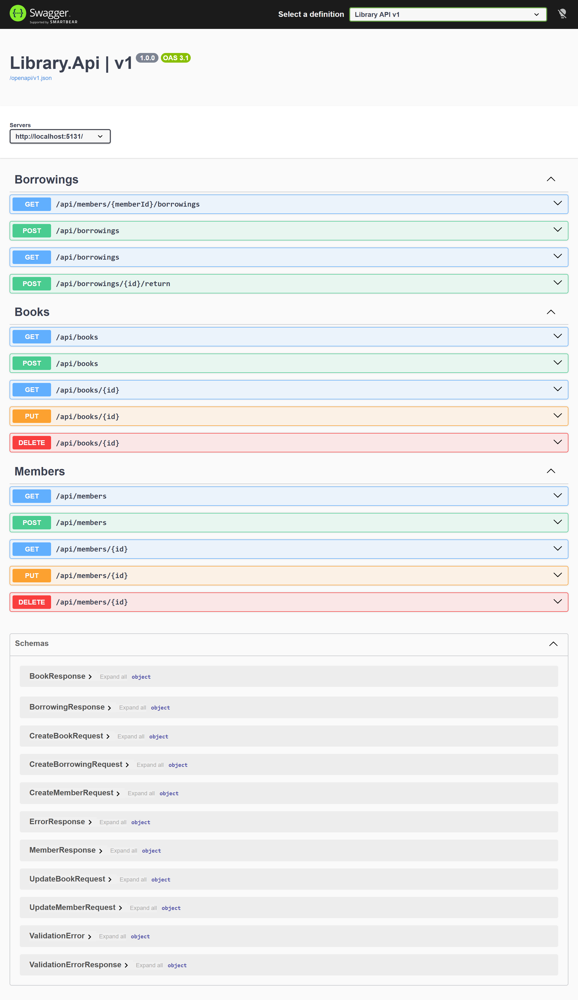
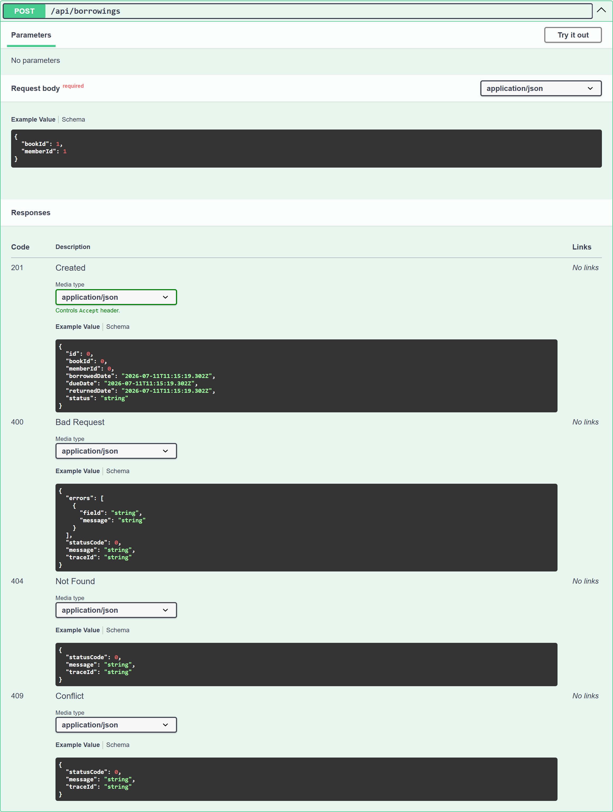

# Library Management System

## Overview

This project is a .NET 10 Minimal Web API for managing books, members, borrowings, and returns in a small library.
It follows the assessment structure with DTO-based contracts, EF Core, PostgreSQL, Swagger, repository abstractions, and thin endpoint handlers.

## Technologies

- .NET 10
- ASP.NET Core Minimal APIs
- PostgreSQL
- Docker Compose
- Entity Framework Core
- OpenAPI and Swagger UI
- xUnit

## Running PostgreSQL

Start only PostgreSQL with:

```bash
docker compose up -d postgres
```

## Running Migrations

Migrations are applied automatically on startup, so a fresh clone only needs PostgreSQL running before the API starts. This is a deliberate dev-time convenience: a real deployment would run migrations as a separate step before the app boots, rather than granting the running application permission to rewrite its own schema.

To apply them by hand instead, install the local tools:

```bash
dotnet tool restore
```

Then run:

```bash
dotnet ef database update --project src/Library.Infrastructure --startup-project src/Library.Api
```

## Running the API

Run the API with:

```bash
dotnet run --project src/Library.Api/Library.Api.csproj
```

## Swagger

When the app is running in Development, Swagger UI is available at:

```text
http://localhost:5131/swagger
```

The OpenAPI document is available at:

```text
http://localhost:5131/openapi/v1.json
```

## Authentication

The development database seeds this administrator account:

```text
Email: admin@library.local
Password: Admin#12345
```

The mobile authentication flow uses these endpoints:

| Method | Endpoint | Authentication | Purpose |
| --- | --- | --- | --- |
| `POST` | `/api/auth/login` | Anonymous | Issue an access token and refresh token |
| `POST` | `/api/auth/refresh` | Anonymous | Rotate a valid refresh token and issue a new token pair |
| `POST` | `/api/auth/logout` | Anonymous | Revoke a refresh token |
| `GET` | `/api/auth/me` | Bearer token | Return the current account identity |
| `POST` | `/api/users` | Admin bearer token | Create an Admin or Member login account |

Member accounts must reference an existing member ID. Admin accounts must use a null `memberId`. Access tokens last 60 minutes and refresh tokens last 30 days by default. Store both in the mobile platform's secure credential storage and replace both values after every successful refresh.

All endpoints grouped by resource, with the request and response contracts and documented status codes:



Each operation documents its request body and every response it can return. For example, `POST /api/borrowings` shows the `201 Created` body alongside the `400`, `404`, and `409` error shapes (`statusCode`, `message`, `traceId`, plus `errors` for validation failures):



## Example Requests

See [Library.Api.http](src/Library.Api/Library.Api.http) for ready-to-run authentication examples.

## Assumptions

- New books start with `AvailableCopies = TotalCopies`.
- New members start with `IsActive = true`.
- `BorrowingStatus.Overdue` exists in the domain model, but automatic overdue detection is not implemented yet.
- Deleting a book or member with borrowing history returns `409 Conflict`.
- Date values are stored and handled in UTC.
- Seed data adds a small set of books and members for local testing.
